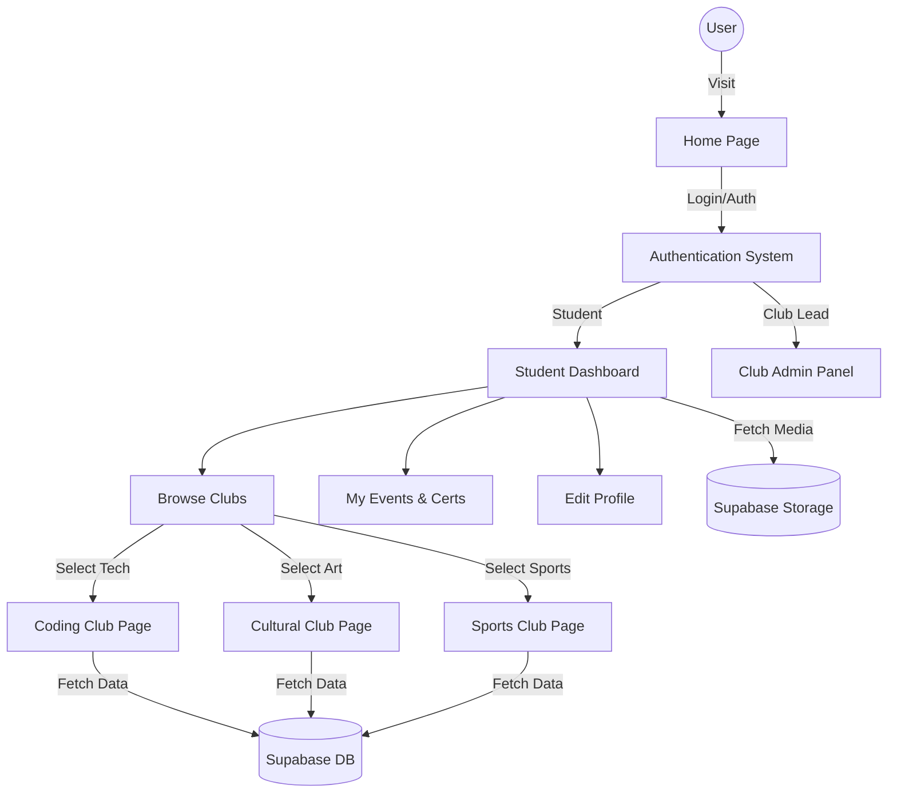
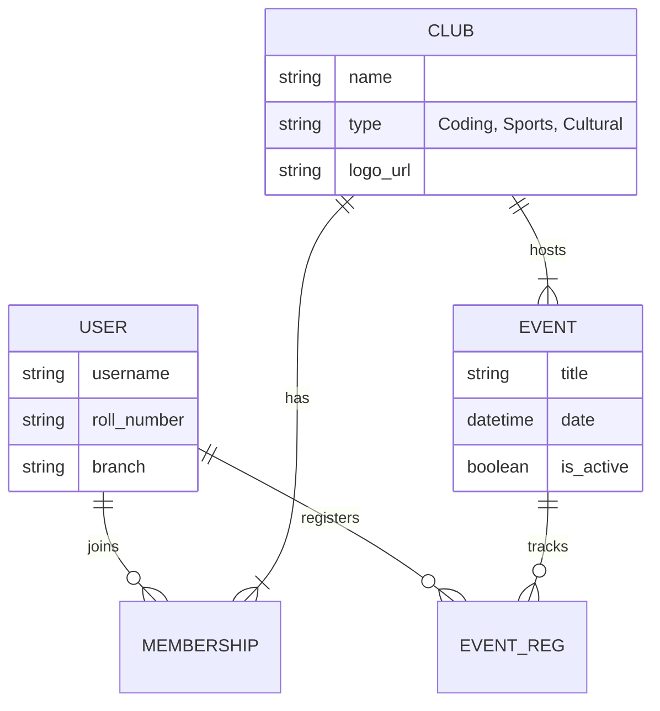

# 🎓 College Campus & Club Management System


**A centralized web platform designed to digitize college operations, streamline club management, and showcase departmental achievements.**

This system serves as a digital bridge between the **Computer Science Engineering (CSE)** department, student clubs, and the entire student body, replacing manual paperwork with efficient digital workflows.

---

## 🚀 Tech Stack

| Component | Technology |
| :--- | :--- |
| **Backend** | Django (Python) |
| **Frontend** | HTML5, CSS3, JavaScript, AngularJS (Interactive Modules) |
| **Database** | PostgreSQL (via Supabase) |
| **Storage** | Supabase Storage (Media/Static Assets) |
| **Hosting** | Render (Web Service) |
| **Diagrams** | Mermaid.js |

---

## 🌟 Key Features & Modules

### 1. 👤 Student Dashboard
A personalized command center for every registered student.
- **Activity Tracker:** Visual statistics of events attended and competitions won.
- **Certificate Vault:** Auto-generated, downloadable digital certificates for completed workshops.
- **Club Management:** Seamless one-click join/leave functionality for various clubs.

### 2. 🏆 Dynamic Club Portals
Tailored layouts for different club types rather than generic templates.
- **💻 Technical/Coding Club:** Features GitHub integration, project repositories, and hackathon countdowns.
- **🎨 Cultural Club:** Focuses on masonry-layout media galleries and audition registration forms.
- **⚽ Sports Club:** Includes live score tickers, team rosters, and equipment inventory status.

### 3. 📢 Department & Notice Board
- **Digital Notice Board:** Replaces physical circulars with a filterable digital list (Academic, Exams, Events).
- **Resource Hub:** Central repository for syllabus, previous year question papers, and lecture notes.

### 4. ℹ️ Utility Pages
- **About Section:** Timeline visualization of the platform's development and the team behind it.
- **Contact Mechanism:** Integrated query forms for general support or bug reporting.

---

## 📂 System Architecture

The platform facilitates specific workflows for **Students**, **Club Admins**, and **Department Heads**.



 ## 📂 Project Directory Structure
```bash

college_portal/
│
├── manage.py                # Django command-line utility
├── requirements.txt         # Project dependencies
├── .env                     # Environment variables (GitIgnored)
├── README.md                # Project documentation
│
├── college_portal/          # Project Configuration
│   ├── __init__.py
│   ├── settings.py          # Main settings (Apps, Database, Middleware)
│   ├── urls.py              # Root URL routing
│   ├── wsgi.py              # WSGI config for Render
│   └── asgi.py
│
├── apps/                    # Custom Applications
│   ├── core/                # Home, About, Contact views
│   ├── accounts/            # User authentication & Profile management
│   ├── clubs/               # Club pages, Events, Memberships
│   └── dashboard/           # Student Dashboard logic
│
├── static/                  # Static Assets
│   ├── css/
│   ├── js/
│   └── img/
│
└── templates/               # HTML Templates
    ├── base.html            # Base template with Navbar/Footer
    ├── accounts/            # Login/Register templates
    ├── dashboard/           # Dashboard widgets
    └── clubs/               # Specific templates (coding, cultural, etc.)

```    

## 🛠️ Installation & Setup

Follow these steps to set up the project locally.

### 1. Clone the Repository
```bash
git clone [https://github.com/your-username/college-club-portal.git](https://github.com/your-username/college-club-portal.git)
cd college-club-portal

python -m venv venv
venv\Scripts\activate

pip install -r requirements.txt


python manage.py migrate
python manage.py runserver

```

## 🤝 Contributing
Contributions are welcome! Please follow these steps to contribute:

Fork the Project.

Create your Feature Branch (git checkout -b feature/AmazingFeature).

Commit your Changes (git commit -m 'Add some AmazingFeature').

Push to the Branch (git push origin feature/AmazingFeature).

Open a Pull Request.
